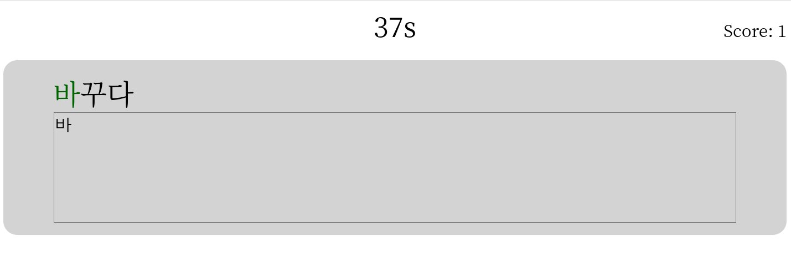

# Nuxt3 Korean Typing Game

This repository contains a korean typing game powered by nuxt3.



## Usage

### Build Korean Phrase Database

NOTE: Since this Anki deck is licensed under Shared Deck License [0], I couldn't share it directly.

+ 1. Download "TTMIK's First 500 Korean Words by Retro": https://ankiweb.net/shared/info/1551455917
+ 2. Unzip the apkg file:

```
$ mkdir ttmik500 && cd ttmik500
$ unzip Korean_Vocabulary_by_Evita.apkg
```

+ 3. Build a SQLite database:

```
$ echo "select flds from notes" | sqlite3 collection.anki2 | raku -ne 'say $0.Str.subst("&nbsp;", :g) if $_ ~~ /\<b\>(.+?)\<\/b\>/' > kr.txt
$ echo "select flds from notes" | sqlite3 collection.anki2 | raku -ne 'say $1.Str.subst("&nbsp;", :g).trim.subst(/^\((.+)\)/,"").subst("<em></em>", "").subst(/<cntrl>/,"",:g).trim if $_ ~~ /\<b\>(.+?)\<\/b\>(<-[\[]>+)/' > en.txt
$ paste -d$'\t' kr.txt en.txt | raku -e 'for $*IN.lines.pairs -> (:key($k), :value($v)) { say "$k\t$v" }' > data.tsv
$ printf 'create table phrase (id integer primary key, kr text, en text);\n.separator "\t"\n.import data.tsv phrase' | sqlite3 database.sqlite3
```

+ 4. Put database.sqlite3 into the `/prisma` dir

### Run

```
$ npm run dev
```

# Citations

+ [0] https://ankiweb.net/account/terms
